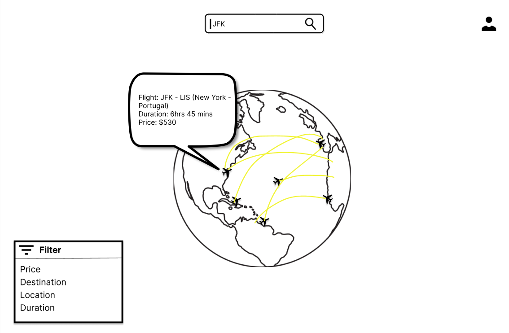

# TakeOff
Take Off is a web application project inspired by FlightRadar24. Users are able to view, search, bookmark, and track flights. Users will be able to filter the flights by location, duration, and distance. Users could sign up and/or login to save their account information and their history of tracked flights. Users could also zoom in and out of the map. HTML, CSS, and Javascript will be used for the frontend development. Python and Oracle SQL will be used for the backend. APIs such as Geolocation will be utilized to get one’s current location and AirLabs to find airport and flight information.

#### Homepage inspiration from [Flightradar24.com]([https://flightradar24.com]):

#### Our Mockup:

# How to run
As the project progress, this will be updated. For now, simply launch [TakeOff-Web-App]([https://cis3296f23.github.io/TakeOff-Web-App/]) 

# How to contribute
Follow this project board to know the latest status of the project: [Project Board]([https://github.com/orgs/cis3296f23/projects/130/views/1])

# How to build 
This project can be built by downloading the git repository and opening index.html using any common web-browser such as Chrome/Safari/Firefox/Microsoft Edge.
